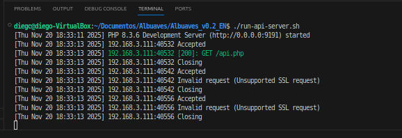

# Proyecto: API + Cliente Java/Kotlin

## Descripción general
Este proyecto incluye una API REST desarrollada en PHP con base de datos SQLite, junto con un cliente en Java/Kotlin que consume los datos proporcionados por la API. El objetivo es mostrar tanto el funcionamiento del servidor como del cliente, así como documentar la infraestructura, scripts y decisiones técnicas.

---

## 📸 Demostración del funcionamiento 

### 0. Imagen general del funcionamiento


### 1. Llamada a la API en el navegador

En mi caso una IP fija de la red privada: http://192.168.3.111:9191/api.php


### 2. Funcionamiento del proyecto en la terminal

En esta imagen se puede ver el correcto funcionamiento y despliegue de la API



# 🛠️ Tecnologías utilizadas 

## Backend (API)
- PHP 8+
- Servidor embebido: `php -S`
- SQLite3 como base de datos
- Extensión `SQLite3` para consultas
- Endpoints disponibles:
  - `GET /api.php` → devuelve todas las aves
  - `GET /api.php?bird_id=X` → devuelve un ave por ID

## Cliente (Java)
- Java 20
- `HttpURLConnection` (librería estándar)
- Manejo de JSON mediante `org.json.JSONArray` y `org.json.JSONObject`
- Clase principal: **SearchBirdsAPI.java**
- Funcionalidades:
  - Realiza petición GET a la API
  - Imprime el JSON crudo
  - Formatea la respuesta en una tabla en la terminal

## Herramientas adicionales
- Git y GitHub/GitLab para repositorio
- VSCode para edición de código
- Bash para los scripts
- Linux como entorno de desarrollo/servidor

---

# 📄 Licencias utilizadas

- PHP → PHP License  
- SQLite → Dominio Público  
- Java → GPL + Classpath Exception  
- Librería org.json → JSON.org License  
- Bash → GPL  

---

# 🤔 Motivación de las tecnologías elegidas

- **PHP + SQLite3**: combinación ligera, rápida de montar y con muy baja complejidad para una API simple.
- **SQLite3**: evita usar un servidor MySQL/PostgreSQL y mantiene el proyecto autocontenido.
- **Java 20**: robusto, moderno y compatible con librerías JSON sencillas.
- **HttpURLConnection**: permite realizar peticiones HTTP sin instalar dependencias externas.
- **JSON.org library**: facilita el parseo del JSON recibido desde la API.
- **Git/GitHub**: ideal para control de versiones y para la entrega del proyecto.

---

# 📘 HOWTO / Tutorial 

## ✔️ 1. Requisitos previos

Instalar:
- PHP 8+
- SQLite3
- Java 20 o superior
- Git
- Bash (para scripts)
- (Opcional) VSCode

---

# 🖥️ 2. Puesta en marcha del Servidor (API)


### 1. Clonar el repositorio
```bash 

git clone git@github.com:SantDevelop/Tarea-Albuaves-DAM.git
cd proyecto/api

```

### 2. Modificaciones, 

En los archivos `java`, `run api`, `api.php`hay que indicar la ip de tu maquina/servidor, preferiblemente una ip fija, en mi caso `192.168.3.111` 

### 3. Ejecución

A la altura del archivo `run-api-server.sh` ejecutar ```run-api-server.sh```

### 3. Acceder a la api

Una vez iniciado ya puedes acceder desde tu navegador, o desde otro navegador en otro dispositivo que se encuentre en la misma red, poniendo en el buscador ```http://192.168.x.x:xxxx/api.php```


## Autor ✍️
Diego Gil


