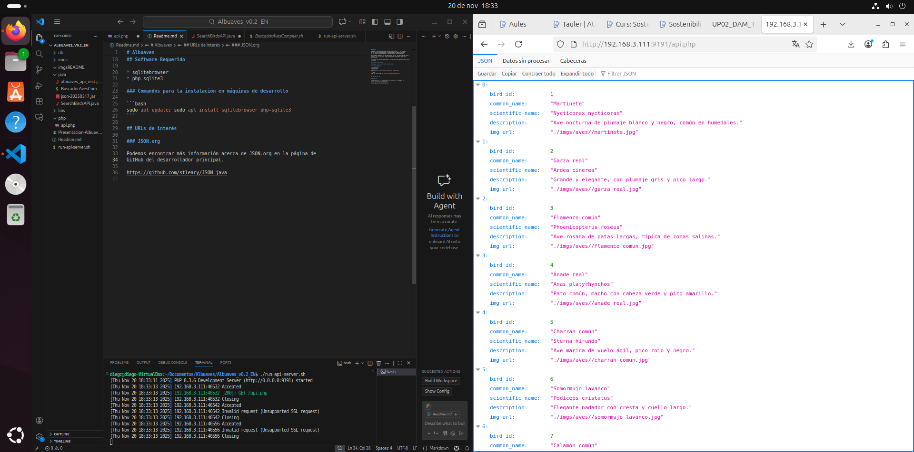
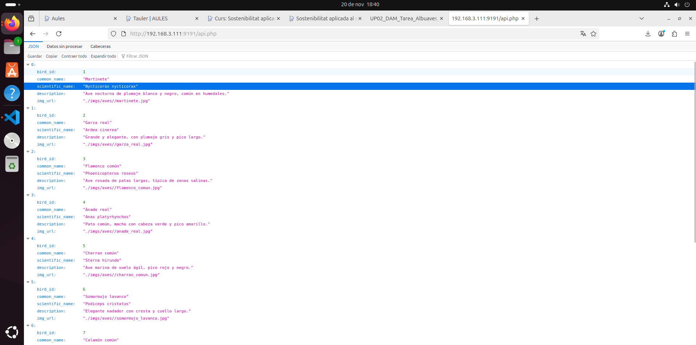

# Proyecto: API + Cliente Java/Kotlin

## Descripción general
Este proyecto incluye una API REST desarrollada en PHP con base de datos SQLite, junto con un cliente en Java/Kotlin que consume los datos proporcionados por la API. El objetivo es mostrar tanto el funcionamiento del servidor como del cliente, así como documentar la infraestructura, scripts y decisiones técnicas.

---

## 📸 Demostración del funcionamiento 

### 0. Imagen general del funcionamiento

### 1. Llamada a la API en el navegador

En mi caso una IP fija de la red privada: http://192.168.3.111:9191/api.php

